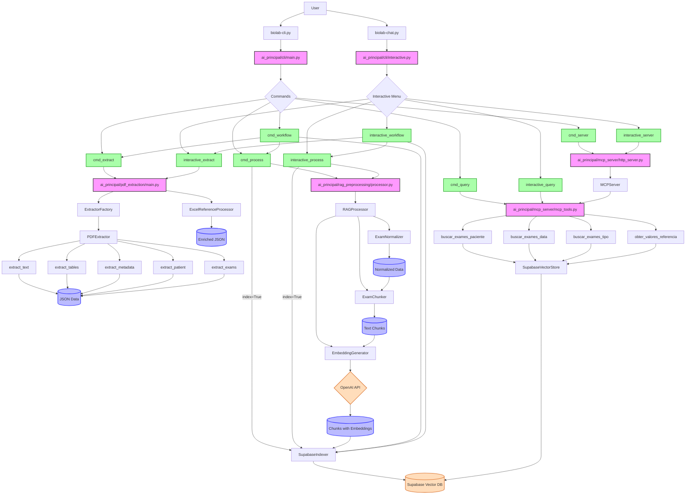

# BioLab.Ai Application Flow

## Detailed Mermaid Diagram



## Simplified Application Flow

```
1. Entry Points
   - biolab-cli.py (Command Line Mode)
   - biolab-chat.py (Interactive Mode)

2. Command Line Workflows
   a. Extract Command
      PDF File(s) → PDF Extractor → JSON Data → (Optional: Enrichment) → Enriched JSON
   
   b. Process Command
      JSON Data → RAG Processor → Normalizer → Chunker → Embedding Generator → Chunks with Embeddings → (Optional: Indexer) → Supabase Vector DB
   
   c. Query Command
      Query Parameters → MCP Tools → Supabase Vector Store → Results
   
   d. Server Command
      Start HTTP Server → Host MCP Server → Handle MCP Requests
   
   e. Workflow Command
      PDF File → Extract → Process → Index → Complete Workflow

3. Interactive Mode Workflows
   - Menu-based interface to the same commands
   - Step-by-step guided flow with user prompts
   - Same underlying components as CLI mode

4. Data Flow Diagram
   Raw PDF → Extracted Text/Tables → Structured JSON → Normalized Data → Text Chunks → Vector Embeddings → Vector Database → Query Results
```

## Visual Representation (Markdown ASCII)

```
+----------+     +----------------+     +-------------------+
|   User   |---->| biolab-cli.py  |---->| cli/main.py       |
|          |     +----------------+     | (Command Parser)  |
|          |                            +-------------------+
|          |                                     |
|          |                                     v
|          |                            +-------------------+
|          |                            | Commands:         |
|          |                            | - extract         |
|          |                            | - process         |
|          |                            | - query           |
|          |                            | - server          |
|          |                            | - workflow        |
|          |                            +-------------------+
|          |                                     |
|          |                              +------+------+
|          |                              v             v
|          |     +----------------+     +-------+     +--------+
|          |---->| biolab-chat.py |---->| Menu  |---->| Cmds   |
+----------+     +----------------+     +-------+     +--------+
                                                        |
                                                        v
+-------------------------------------------------------------+
|                                                             |
|                      PDF EXTRACTION                         |
|  +------------+     +----------------+     +--------------+ |
|  | PDF Files  |---->| PDF Extractor  |---->| JSON Data    | |
|  +------------+     +----------------+     +--------------+ |
|                            |                      |         |
|                            v                      v         |
|                     +--------------+     +--------------+   |
|                     | Reference    |---->| Enriched     |   |
|                     | Processor    |     | JSON         |   |
|                     +--------------+     +--------------+   |
|                                                             |
+-------------------------------------------------------------+

+-------------------------------------------------------------+
|                                                             |
|                     RAG PREPROCESSING                       |
|  +--------------+     +--------------+     +--------------+ |
|  | JSON Data    |---->| Normalizer   |---->| Chunker      | |
|  +--------------+     +--------------+     +--------------+ |
|                                                   |         |
|                                                   v         |
|  +--------------+     +--------------+     +--------------+ |
|  | Embeddings   |<----| OpenAI API   |<----| Text Chunks  | |
|  +--------------+     +--------------+     +--------------+ |
|        |                                                    |
|        v                                                    |
|  +--------------+                                           |
|  | Supabase     |                                           |
|  | Vector DB    |                                           |
|  +--------------+                                           |
|                                                             |
+-------------------------------------------------------------+

+-------------------------------------------------------------+
|                                                             |
|                        MCP SERVER                           |
|  +--------------+     +--------------+     +--------------+ |
|  | HTTP Server  |---->| MCP Server   |---->| MCP Tools    | |
|  +--------------+     +--------------+     +--------------+ |
|                                                   |         |
|                                                   v         |
|  +--------------+     +--------------+                      |
|  | Search       |---->| Supabase     |                      |
|  | Results      |<----| Vector Store |                      |
|  +--------------+     +--------------+                      |
|                                                             |
+-------------------------------------------------------------+

+-------------------------------------------------------------+
|                                                             |
|                    COMPLETE WORKFLOW                        |
|                                                             |
|  +-------+     +--------+     +--------+     +----------+   |
|  | PDF   |---->| Extract|---->| Process|---->| Index    |   |
|  | File  |     | Data   |     | RAG    |     | Supabase |   |
|  +-------+     +--------+     +--------+     +----------+   |
|                                                             |
+-------------------------------------------------------------+
```

## Component Descriptions

### Entry Points
- **biolab-cli.py**: Command-line interface for direct command execution
- **biolab-chat.py**: Interactive menu-based navigation for easier usage

### Key Components
- **PDF Extraction Module**: Extracts structured data from PDF medical exam files
- **RAG Preprocessing Module**: Normalizes data, chunks text, and generates embeddings for semantic search
- **MCP Server**: Implements Model Context Protocol for integration with LLMs
- **Supabase Integration**: Vector database storage and retrieval

### Workflows
1. **Extract**: PDF → Structured JSON
2. **Process**: JSON → Vector Embeddings
3. **Query**: Search Parameters → Matching Exams
4. **Server**: Expose MCP API for LLM Integration
5. **Workflow**: End-to-end Processing (PDF → Indexed Database)